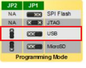
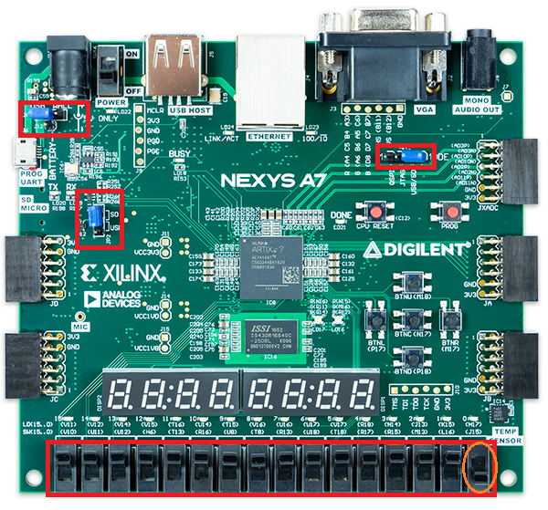

[comment]: [](https://nodesource.com/products/nsolid)


# WD RISC-V Firmware Package 
This repository is WD RISC-V Firmware package, holds:

  - WD-Firmware
  - GCC 10.2.0 Toolchain for RISC-V
  - LLVM/Clang 12.0.0 Toolchain for RISC-V ***[along with Custom GCC Binutils COMRV]***
  - Eclipse MCU


# Getting the sources
  This repository use LFS.
  If you don't have git LFS installed, please do the following steps (based on Debian/Ubuntu):
  
    $ curl -s https://packagecloud.io/install/repositories/github/git-lfs/script.deb.sh | sudo bash
    $ sudo apt-get install git-lfs
  
  Getting the repository 
    
    $  git clone https://github.com/westerndigitalcorporation/riscv-fw-infrastructure.git
    
    Since we use LFS it is adviced to use shallow cloning (without all history)
    
    $  git clone --depth 1 https://github.com/westerndigitalcorporation/riscv-fw-infrastructure.git
[comment]:  [] (This repository uses submodules..... )
  
[comment]:  [] ($ git clone --recursiv https://bitbucket.wdc.com/scm/ctoriscvfwinfra/infra-riscv-fw.git)

# Code Convention 
    See [./code convention.htm]

# WD Firmware     
The “WD Firmware package” constitutes an SDK FW. It contains Firmware applications and Processor Support Package (PSP) for various cores, alongside demos which support all features.
The following README file describes how to setup a build environment for the WD RISC-V firmware. It guides how to build the program, downloading it, and debugging it on the supported platforms and cores.
The FW-Infra was verified with VMWare player v. 15 hosting Debian 9.6. 


#### Current FW support:
- **RTOS-AL** 
    Abstraction Layer (AL) on embedded small footprint real time operation systems (RTOS). The target is to provide homogenies API for the developer usage, so the kernel can be replaced for several different RTOS’s, without any need from the developer to change its application code. 
    Currently this AL supports FreeRTOS and ThreadX (only API's, without core) with a real running demo for FreeRTOS. 
    The structure of WD Firmware package allows quick and easy integration for more RTOS’s, Platforms, boards and new firmware features. 
    Demos is based on HiFive FW example, by SiFIve. Currently the reference is part of FreeRTOS maintenance 

- **Coming soon**: more FW features and more Platform supports 

#### Current Platform and Core support:
- **HiFive1** 
- **SweRVolf** - running on *Nexys-A7 FPGA* EH1, EH2 and EL2 with full SoC ( [LINK to source](https://github.com/chipsalliance/Cores-SweRVolf) )
- **Whisper**  - ISS tool running EH1,EH2,EL2 ( [LINK to source](https://github.com/chipsalliance/SweRV-ISS) )


### Source tree structure 
```javascript
WD-Firmware
     ├── board                                <-- supported boards
          ├── hifive-1                        
          ├── nexys_a7_eh1 (support for SweRV eh1, running on SweRVolf)
          ├── nexys_a7_eh2 (support for SweRV eh2)
          ├── nexys_a7_el2 (Support for SweRV el2, running on SweRVolf)
          ├── whisper (SweRV ISS Support for SweRV eh1, eh2, el2)
     ├── common                               <-- common source
     ├── comrv                                <-- ComRV - Cacheable Overlay Mangager for RISC-V (core source)    
     ├── demo                                 <-- demos source 
          ├── build                           <-- example build scripts
             ├── toolchain                    <-- container for the unzip toolchains 
          ├── demo_rtosal.c                   <-- Abstruction Layer (AL) demo on FreeRTOS
          ├── main.c                          <-- The main of all demos
          ├──  ....
     ├── psp                                  <-- psp functionality
     ├── rtos
          ├── rtosal                          <-- rtos abstraction layer
          ├── rtos_core                       <-- specific rtos source code
                ├── freertos
                ├── ....
```

### Additional downloads
	NOTE: The COMRV demo will work only with the LLVM toolchain, GCC is not supported
- #### Toolchain binary download links:
	- GNU  ( [GNU release folders](https://wdc.box.com/s/lfam8pwhghwshkmjf1yc542ghzfbyn7y) )
	- LLVM ( [LLVM release folders](https://wdc.box.com/s/v562eei6d01bhzqcc4si76z1vq0w4ibu) )
	
- #### Using GCC Toolchain
	- From the repo root folder unzip riscv-gnu-toolchain-debian.tar.gz to the ***WD-Firmware/demo/build/toolchain*** directory

      	  $ tar -xvf riscv-gnu-toolchain-debian.tar.gz -C ./WD-Firmware/demo/build/toolchain/

- #### Using LLVM Toolchain
	- From the repo root folder unzip riscv-llvm-toolchain-debian.tar.gz to the ***WD-Firmware/demo/build/toolchain*** directory
	
          $ tar -xvf riscv-llvm-toolchain-debian.tar.gz -C ./WD-Firmware/demo/build/toolchain/

- #### Other download
    - From the repo unzip eclipse_mcu_2019_12.tar.gz to your designated directory for the Eclipse MCU

          $ tar -xvf eclipse_mcu_2019_12.tar.gz -C [Eclipse-MCU-root]

    - Standard packages that are required can be installed by the following command:

          $ sudo apt-get install scons libftdi1-2 libmpfr4
    
        NOTE: If libmpfr4 can not be installed, in cases of newer versions '6', on the host machine, you can create a symbolic link to libmpfr.so.6
    
          $ sudo ln -s /usr/lib/x86_64-linux-gnu/libmpfr.so.6 /usr/lib/x86_64-linux-gnu/libmpfr.so.4 
    - Download and install Java SE Runtime Environment

    - For RISC-V OpenOCD, you will need the following depended libs: libusb-0.1, libusb-1.0-0-dev, libusb-dev

          $ sudo apt-get install libusb-0.1 libusb-1.0-0-dev libusb-dev
    
### Building for source
- #### Preparations 
    - Launch Eclipse MCU - [Eclipse-MCU-root]/eclipse/eclipse
    - Import WD firmware code:
    	- From 'Eclipse MCU' menu bar select *File* -> *Import*
    	- In the Import window select *General* -> *Existing Projects into Workspace* -> *Next*
    	- In the next Import window *Select root directory* -> *Browse*  and choose the infra-riscv-fw/WD-Firmware/ you've downloaded in 'Getting the firmware sources' section
    	- Press *'Finish'* button
&nbsp;
- #### Build - compile and link 
    - You will need to choose a specific ***demo*** for building a full solution:

            From the eclipse terminal or console:
            $ cd [WD-firmware-root]/WD-Firmware/demo/build
            $ ./config.sh
            
            Then you will be asked to choose a demo.
            For more explanation on adding new demos please read the readme file on ***'/demos'***
           
      **Note**: to run the script you will need `Python`, we support **`Python 2.7`** only      
      
    - From 'Eclipse MCU' menu bar select '*Project'* -> *'Build All'*. Note that you can select which platform to build for.
    - Since the building process use SCons build system, you can build via console/terminal. Please read the readme on ***’/build’*** 

### Platforms Downloading & debugging 
We provide several platforms to work with, please follow the instructions for the one you preferred.

- #### Setting up Hifive1 - FTDI over USB (taken from SiFive Freedom Studio Manual v1p6).
	- Connect to your HiFive1 debug interface and type "lsusb" to see if FT2232C is connected:

            $ lsusb
            Bus ... Device ... : ID 0403:6010 Future Technology Devices International, Ltd FT2232C Dual USB-UART/FIFO IC
            ...
            
	- Set the ___udev___ rules to allow the device to be accessed by the plugdev group

            $ sudo cp [WD-firmware-root]/WD-Firmware/board/hifive1/99-openocd.rules  /etc/udev/rules.d/
            
	- Add and verify current user to ___plugdev___ group

            $ sudo usermod -a -G plugdev $USER
            $ groups
            ... plugdev ...
	- Power off/on Debian station
&nbsp;
- #### Setting up Nexys-A7 for SweRV - SweRVolf 

    ***EH1 and EL2*** SweRVolf are fpga files create by Olof Kindgren under CHIPS-Alliance
    If you wish to know more please use this link: [Cores-SweRVolf](https://github.com/chipsalliance/Cores-SweRVolf)

    ***For the FPGA bit file loading, do the following steps:***
    - ***FPGA image file loading***: using uSD device
    	- Copy the FPGA bit file to a uSD device from the following path:
      	  1. For SweRV eh1: /WD-Firmware/board/nexys_a7_eh1/***eh1_reference_design.bit***
    	  2. For SweRV eh2: /WD-Firmware/board/nexys_a7_eh2/***swervolf_eh2.bit***
    	  3. For SweRV el2: /WD-Firmware/board/nexys_a7_el2/***swervolf_el2.bit***
    	- Connect the uSD to the Nexys-A7 board (uSD slot is on board's bottom)
		- Set the following jumpers:  `JP1 - USB/SD pins.   JP2 - connect the 2 pins on 'SD' side`
		- Slide switch `sw0 to OFF` and `all others to ON`
        
        
        
        
		- At power-on the FPGA bit file is loaded to the FPGA. LED 'Busy' should be ORANGE while flushing is done
		- Wait for ORANGE led to be off, once off the board is ready to be used

    - ***FPGA image file loading***: using eclipse MCU:
    	- From eclipse IDE menu bar open the External Tools Configurations: *'Run'* -> *'External Tools'* -> *'External Tools Configurations...'*
    	- Under the *Program* list, select:
    	  1. For SweRV eh1: ***nexys_a7_eh1_flush*** and press the *Run* button
    	  2. For SweRV eh2: ***nexys_a7_eh2_flush*** and press the *Run* button
    	  3. For SweRV el2: ***nexys_a7_el2_flush*** and press the *Run* button
    	- The eclipse IDE Console will display *shutdown command invoked* upon completion

&nbsp;

- #### Setting up ISS (works as simulator for SweRV EH1, EH2 and EL2)
    
    There is nothing to set for SweRV ISS, just select debugger luncher (following next)..
&nbsp; 
- #### Platforms Debug on Eclipse MCU Debug:
    - Select from the ***'Eclipse MCU'*** menu bar ***'Run' -> 'Debug Configurations...'***; 
    - Choose the platform you wish to run on, from **'left main windows'** menu
    - Current support:
        ```javascript
        - hifive1                              <-- HiFive Eval board
        - nexys_a7_eh1_swerolf                 <-- Nexys A7 digilent FPGA board running SweRV EH1 
                                                   with full System on chip support. 
                                                   From chipsalliance/Cores-SweRVolf
        - nexys_a7_el2_swerolf                 <-- Nexys A7 digilent FPGA board running SweRV EL2 
                                                   with full System on chip support. 
                                                   From chipsalliance/Cores-SweRVolf
        - nexys_a7_eh2_swerolf                 <-- Nexys A7 digilent FPGA board running SweRV EH2 
                                                   with full System on chip support. 
        - whisper_eh1_connect_and_debug        <-- ISS simulator for SweRV EH1
        - whisper_eh2_connect_and_debug        <-- ISS simulator for SweRV EH2
        - whisper_el2_connect_and_debug        <-- ISS simulator for SweRV EL2
        - whisper_eh2_connect_and debug_multi_hart <-- same as whisper_eh2_connect_and_debug BUT with 2 HW 
                                                       threads (HARTs) running simultaneously
        ```

### Adding new source modules

The folder WD-Firmware/demo/build/ contains a template file (SConscript_template) which can be used.
&nbsp;
# Supporting GCC Releases
- #### RISCV GCC 10.2.0
	- RISCV official 10.2.0 GCC release
	- Official GDB 9.2.0
	- Check gcc-hash.txt for the precise commits of toolchain build


# Supporting LLVM Releases
- #### RISCV LLVM/Clang 12.0.0
	- Initial LLVM/Clang official 12.0.0 release
	- ComRV support modules
	- Check llvm-hash.txt for the precise commits of toolchain build

# Notes and status
This repo is always under work, following are notes and status for items that is still missing or under work.
- #### 05-Oct-2020
    - All EH2 demos are working only on Whisper, no fpga
    - Currently, Software-Interrupts are not supported in EL2 fpga. Until it will be supported, you can use Whisper for this demo.
    - Bitmanip is supported only on LLVM.
    
- #### 28-Feb-2021
    - All EH2 demos are working including FPGA support
    - Supporting SMP debugging for EH2
    - Support ComRV data overlay
    - EL2 includes dccm 
    - Added getchar() demo
